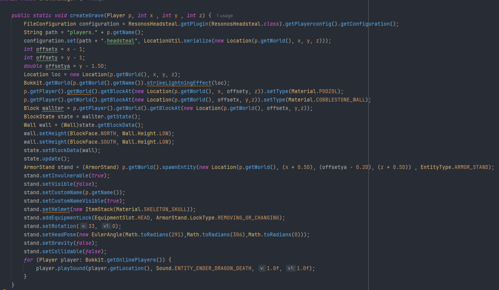

# HeadstealGraves ✨💀

A lifesteal gamemode and grave system plugin for a youtuber SMP server. Commissioned by LivingLegendOP & Sevokii.\

**Developed by Shifuu @Resonos Studios**

One line of code resulted in a bug that made for a fun exploit:\

## What it does 🔍
1. Players have a persistent life counter (default: 3).
2. Each death removes a life — at 0 lives the player becomes a spectator and is marked as "dead". 🪦
3. A grave appears where you died: skull with your name, a cobblestone wall, podzol floor, lightning flash and dramatic sound. ⚡🔊
4. Craftable items:
   1. Soul Fragment — a special skull item used for boosts and crafting. 💠
   2. Revive Beacon — consumes Soul Fragments and nether materials to bring a dead player back. 🕯️
5. Rank (prefix) changes via LuckPerms depending on remaining lives; Fallen role/permission applied on death. 🎭
6. Player grave and death data persist across restarts in `players.yml`. 💾

## How to use — for players 🎮
1. Install: drop the plugin JAR into the server `plugins` folder and restart the server. Server requires LuckPerms and LPC for prefixes.
2. Play loop:
   1. Start with 3 lives. Survive fights and exploration.
   2. Die → lose a life → grave marks your location. Your skull shows your name. 💀📍
   3. At 0 lives you become a spectator and get the Fallen identity until revived.
3. Reviving:
   1. Craft Soul Fragments and make a Revive Beacon to revive someone at their grave.
   2. Right‑click a grave (armor stand) while holding a Revive Beacon to restore that player. ✅
   3. Server operators can revive players using admin tools if needed.

## PlayerListener — player-facing features ⚙️
1. Join:
   1. Creates a profile for new players and updates their rank prefix based on current lives.
2. Death:
   1. Plays a dramatic sound and broadcasts a death message noting remaining souls.
   2. Removes one life, reduces max health slightly, drops the player head when lives hit 0, and creates the grave visual.
   3. If a Fallen player is killed, the plugin can remove their Fallen status and automatically revive players they previously claimed.
3. Consuming a player head:
   1. Right‑clicking a `PLAYER_HEAD` consumes it, grants extra max health, gives Fallen status (prefix + permission), records the consumed head owner as a killer, and plays effects. 🔥
4. Soul Fragment use:
   1. Right‑clicking a Soul Fragment grants a temporary Strength boost and starts a cooldown. ⏱️💥
5. Dead player movement:
   1. Dead players are restricted to their last death location and can only spectate nearby.
6. Grave interactions:
   1. Graves are clickable armor stands. Right‑click with a Revive Beacon to consume the beacon and revive the grave owner.
7. Block protections:
   1. Prevents placing Soul Fragment skulls so mechanics stay controlled.

## Ranks & visual prefixes (what players see) 🎨
1. Lives → prefix color (set via LuckPerms):
   1. 3 lives: green (`&a`) — healthy. 🌿
   2. 2 lives: yellow (`&e`) — caution. ⚠️
   3. 1 life: red (`&c`) — critical. 🔥
   4. 0 lives: gray (`&7`) — spectator. 🕊️
2. Fallen Angel role:
   1. Consuming a player head grants a special Fallen prefix (`&c&lFallen `) and the permission node `resonos.fallen`. Fallen players are tracked as killers for revive interactions.

## Crafting recipes (player visuals) 🧪
Soul Fragment (result: custom skeleton skull)  
Shape:  
D R D  
R D R  
D R D

D = Diamond Block  
R = Redstone Block

Revive Beacon (result: custom named Beacon)  
Shape:  
F C F  
I S I  
F C F

F = Soul Fragment (the custom item)  
C = Crying Obsidian  
S = Nether Star  
I = Netherite Ingot

## Commands and permissions ⌨️
1. `/lifesteal` — shows the plugin info message to the player.
2. `/revive [player]` — revives a dead player (admin only).
3. `/lives [player]` — shows the life count of self or another player (admin only).
4. `/setlives <player> <number>` — sets a player's life count (admin only).

## Admin notes 🔧
1. Dependencies: `LuckPerms` and `LPC`.
2. Player data saved in `players.yml` includes `headsteal` (grave location), `dead` (boolean), and `killer` (who consumed/claimed a head).
3. Prefixes and Fallen permission are managed automatically via LuckPerms.

## Quick FAQ ❓
1. How many lives? Default is 3.
2. Who can revive? Players with a Revive Beacon or server admins.
3. Do graves keep my items? Item handling depends on server rules; this plugin focuses on lives, graves and revival.
4. How is the grave wall made? It generates a cobblestone wall with a podzol floor and places an armor stand with your skull.

